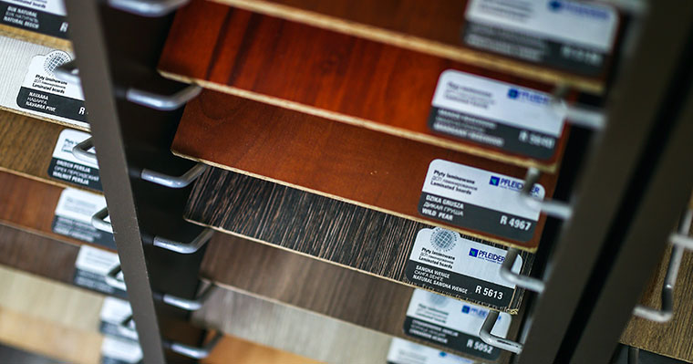

Cabinets are one of the most important things to have in a kitchen, it's where you can store utensils, food, spices, pretty much anything of your choice.And ultimately it helps you to hide or even prevent clutter in your kitchen.

But also when it comes to the subject of cabinets, especially if you're renovating your kitchen, there's probably going to be some questions. 

So here are 3 questions and answers that may be helpful:

## Where's the best place to have your kitchen cabinets?

The most recommended place to install  kitchen cabinets is above your head, it allows you to have more floor space in your kitchen, especially if you have a small kitchen.

## Does adding new cabinets in my kitchen increase the value of my home?

Absolutely, because one of the most primary places where a home buyer inspects is the kitchen, and if the kitchen looks modern and new it is probably going to catch the homebuyers eye.

## What are the cabinets made of in Centro Carpintero? 

In centro carpintero we primarily use 3 different types of wood which are Parota wood, Amapa (rosewood), and primavera wood.
These 3 types of wood I mentioned are very durable and also affordable if you're on a budget.

