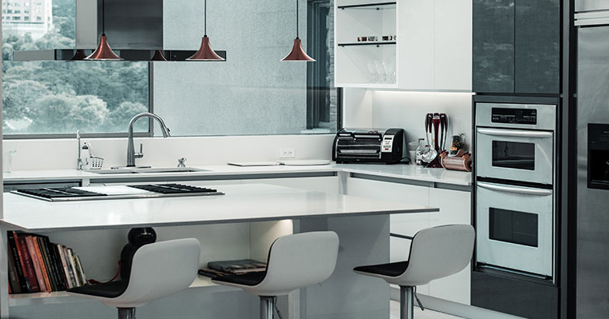

Are you thinking of updating your kitchen? Well no problem, I'm going to mention 4 simple common kitchen trends to follow, to make your kitchen feel comfortable, and most importantly make it reflect on who you are.

## Adding Warmer Tones.

Adding different color tones in a kitchen is probably the most common thing to do when wanting to update your kitchen. 
It adds a pop of color and also highlights different parts of your kitchen.
If you are thinking of warm outdoorsy colors, it is wise to choose Brown, Grey, or Beige as the three more fashionable colors for that look. Also if you are thinking of going with warm tone colors, it will be wise to add hints of Gold, Champagne, or Copper.

## Storage Walls

Storage walls are something that is common to typically see in trendier homes because of their elegant look and how it is more spacious and better to properly organize your stuff. It also is great to have in your kitchen if your kitchen is severely limited in space and feels cramped.

## Adding Unique New Faucets

Adding a new faucet to your kitchen makes your kitchen feel stylish and fashionable, because every little detail typically plays a big role in your kitchen.
When carefully choosing a faucet there are so many different colors and designs, but when it comes to what's current and trendiest faucet, you're looking at matte black and matte white faucets.

## Oversized Pantries Are Ideal

This trend is probably only applied to those that have a lot of space in their kitchen, the reason it's better is that it's easier to organize as well as you have more space to add more. Make sure you accurately evaluate the dimensions of your kitchen before you start on the project. And as well do not forget to add lighting to your pantries.

