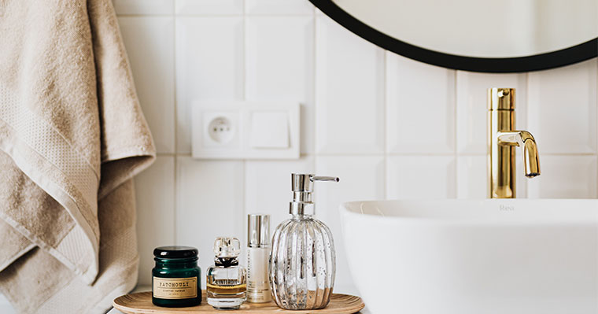

Following the latest trends is the most common thing many people do, and when it comes to the topic of bathrooms there are so many different styles, designs, and features people add to their bathroom to give them that sense of comfort and especially to feel good about themselves, and at Centro Carpintero that is our primary focus, so to make that easy I'm going to mention 5 new popular trends of 2021, that I hope may be helpful. 

## ADD WOOD ACCENTS.

Having warmer tones in your bathroom is very popular when it comes to trends, and one way of adding that warmth to your bathroom is by having that classic dark or light wood accent. So by adding wood cabinets, shelving or even a vanity will add that pop of warmth to your bathroom. 

## HAVE BIG BATHTUBS & OPEN SHOWERS.

If you're remodeling your bathroom and you adding an expansion for more space then why not think about adding a bigger bathtub or even adding an open shower, doing that makes you feel like you have more space, and also it helps you feel relaxed especially after a long day from work, and also most importantly it adds more value to your home.

## ADD TILE PATTERNS. 

When it comes to choosing bathroom tile there are so many designs to choose from like there's different colors, sizes, and shapes but when it comes to what is the most popular and trendiest of them all is the stack-bond and the straight pattern, and when you choose this design you have to have it on top of another pattern and by doing that it makes the bathroom look neat and trendy.    

## ADD VINTAGE COLORS LIKE BRASS & GOLD.

Having gold or brass fixtures in your bathroom has been around for quite a while and the look has never gotten old and the reason why it's never gotten old is that it makes your bathroom feel warm and luxurious.

## ADD DAKER COLORS.

Having dark colors in your bathroom has been getting more popular little by little, and one of the most popular colors that are slowly leading to domination is the color black and gray, and the reason it is becoming so popular is that it adds accents to the fixtures in your bathroom which makes your bathroom have that vintage modern look.

