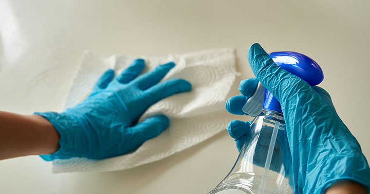

When we install your new cabinets, you probably want them to remain and have the same look for the many years to come, so I'm going to mention the maintenance in keeping your cabinets looking new.

## The Do's
 * Avoid exposing your cabinets to high heat sources, to prevent your cabinets to dry out, crack, shrink or warpage that will be permanent.  
 * Polish your cabinets at least once or twice a year, using an oil-based polisher not wax-based.
 * Dry the cabinets thoroughly when you're done cleaning.
 * Use a little dishwashing soap and warm water when cleaning.
 * Use a synthetic microfiber cloth when wiping your cabinets.
 
## The Don'ts
 * Don't use products that contain bleach.
 * Don't use a dishcloth when cleaning your cabinets because it may contain grease or even particles that can ruin the finishing.
 * Don't soak your cabinets.
 

