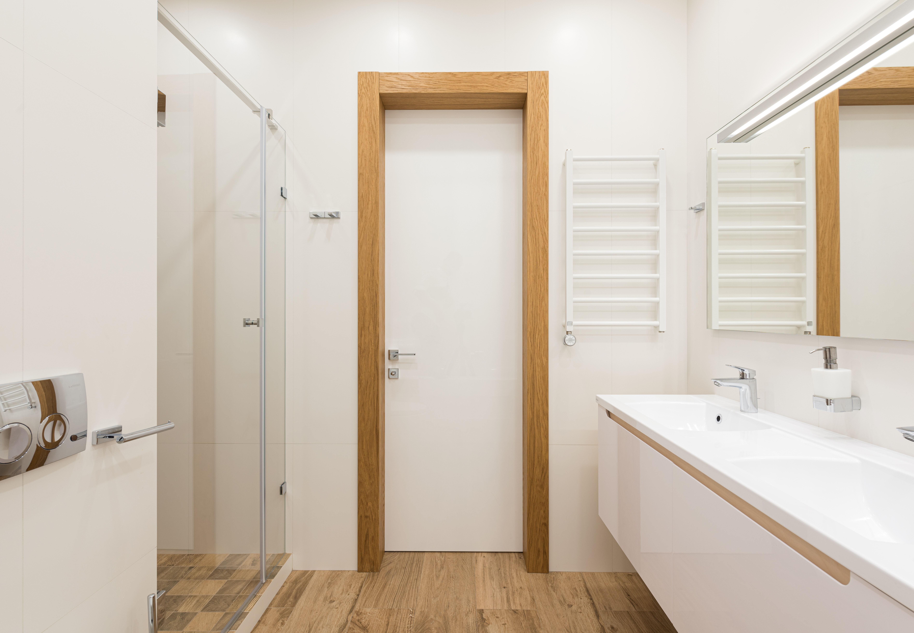

When you have limited space or a large family, you may want to consider a Jack and Jill bathroom. Just like any type of bathroom renovation it's always going to come with its own pros and cons. By comparing the two you can decide if it's the right choice. 

##  What is a Jack and Jill Bathroom?

A Jack and Jill bathroom is a bathroom that is shared by two rooms, meaning that it has two separate entrances to the bathroom. Some Jack and Jill bathrooms have separate vanities or separate sinks. Privacy is also ensured by having a lock on both doors.

###  Pros of a Jack and Jill Bathroom

 #### Save Space

Bathrooms take up a lot of space in the house, especially if every bedroom had their own bathroom, but having two bedrooms share a bathroom saves a ton of space in a home, especially if you already don't have a lot of free space in your house.

 #### Helpful for Large Families

Jack and Jill bathrooms are helpful for large families and even for visiting guests. Although the people who are sharing the bathroom may need to work out who gets the bathroom, a shared bathroom like this can help your household handle multiple people more efficiently.

 #### Still Provide Privacy

Although a Jack and Jill bathroom is a shared bathroom, it still allows people to have privacy. Because the bathroom doors should have locks on either side, the bedrooms connected to it still remain separate and maintain privacy. And, since both doors can be locked, the bathroom provides privacy when needed. You can create a layout if needed to include an extra separation between the sink area and the bath/shower and toilet to provide more privacy if needed.
 

### Cons of a Jack and Jill Bathroom

 #### Jack and Jill Bathrooms Can be Isolated

When a Jack and Jill bathroom is located between two bedrooms, it means that it is not as accessible to the rest of the house. Most of the time, this isn't an because  there are other bathrooms available in the home. Also,it shouldn't be an issue if it connects to a hallway.

 #### They Can Create Conflict

Jack and Jill bathrooms can create conflict. Because more than one person needs to use it. One of the most common bathroom design mistakes to avoid is ignoring or failing to plan for proper flow and function. Having the right flow and function is essential to any bathroom and especially a Jack and Jill bathroom.

When schedules get hectic and people get stubborn, a bathroom like this can become a point of contention. The other side of that is the people who share it need to learn how to share, compromise, and communicate to each get what they need.

 #### Jack and Jill Bathrooms May Not Remain Useful Long-Term

Because these bathrooms are connected to specific bedrooms and can become landlocked in some ways, they can also become less useful and efficient over time. For example, if you decided on a Jack and Jill bathroom for specific family members, is that bathroom layout still going to make sense as those family members grow and eventually move out?

