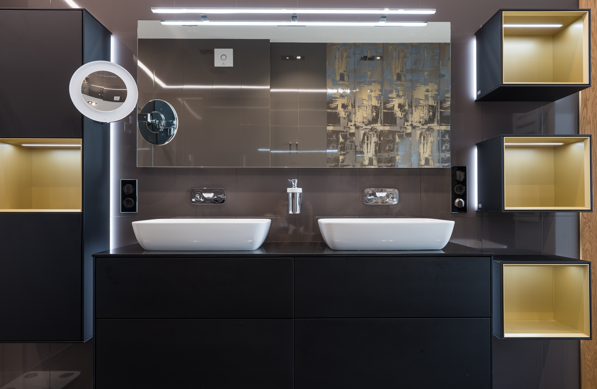

Double vanities is having two separate sinks in the same bathroom, and this old trend has been something common to see in homes, but just because it's a common thing to see in bathrooms doesn't mean it's for everyone, so I'm going to help you decide if installing a double vanity in your bathroom is the right choice for you or if changing your already existing double vanity into just a single vanity. 

## The Pros of a double vanity?

 * Two can use it at the same time

When having a double vanity it means that two people are able to share the bathroom at the same time, which can come in handy, because you don't have to wait for your mate to finish using the sink meaning it is going to save you some time.

 * It's going to adds value to your home

The value to your home is going to go up, because you added a double vanity, and means that all the maintenance and work that you put into it will be payed of when you sell it, and the reason it's going to add value to your home is because many people view having a double vanity as a luxury, especially when your clients or buyers are couples or large families.

## And last but not least, the Cons of a double vanity?

 * The cost

Having a double vanity is going to cost more than having a single vanity by far. When you think about it, it means that there's going to be double plumbing, as well you will need to install a larger or longer vanity to be able to fit the two sinks, and because you have two sinks, then just having one, there's going to be more maintenance.

 * Less space

Like I mentioned before, having a double vanity means that you're going to need to install a bigger and longer vanity, this means that the layout of the room is going to be smaller (depending on the layout of the room), also having a double sink is going to take some of your counter space.

<strong>TIP:</strong> Before installing a double vanity in your bathroom make sure you have enough space to move around, because no one wants to be wedged together with their mate  when brushing your teeth.   

