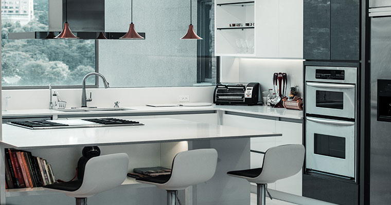

A custom kitchen island isn't just a trend—it's the heart of modern kitchen design in Puerto Vallarta. Whether you're renovating your vacation home or upgrading your permanent residence, a well-designed island transforms your kitchen into a functional masterpiece that reflects the beauty of coastal Mexican living.

At Centro Carpintero, we've designed and built hundreds of custom kitchen islands for discerning homeowners throughout Puerto Vallarta. Here's everything you need to know to create the perfect island for your space.

## Why Every Puerto Vallarta Kitchen Needs a Custom Island

### The Functional Benefits

**Entertainment Hub**
- Perfect for hosting gatherings in your tropical paradise
- Creates natural conversation flow during parties
- Provides bar seating for casual dining with ocean views
- Serves as a buffet station for entertaining guests

**Storage Solution**
- Maximizes storage in open-concept floor plans
- Custom cabinets designed for your specific needs
- Wine storage, pot drawers, and appliance garages
- Keeps countertops clutter-free and organized

**Workspace Expansion**
- Additional prep space for cooking enthusiasts
- Dedicated area for baking and meal preparation
- Built-in cutting boards and specialized work surfaces
- Ideal for families who love to cook together

**Property Value Boost**
- Increases resale value by 10-15% on average
- Highly sought after by vacation rental guests
- Distinguishes your property in competitive markets
- Showcases quality craftsmanship and attention to detail

## Choosing the Perfect Materials for Coastal Living

### Tropical Hardwoods: The Premium Choice

**Parota Wood Islands**
Our signature material for stunning, durable islands:
- **Natural beauty**: Rich golden-brown tones that warm any space
- **Humidity resistant**: Perfect for Puerto Vallarta's coastal climate
- **Pest resistant**: Natural protection against tropical insects
- **Unique character**: Each piece features distinctive grain patterns
- **Sustainable choice**: Fast-growing, responsibly sourced

**Kumaru for Outdoor Kitchen Islands**
For covered outdoor kitchens and BBQ areas:
- Extremely durable in tropical weather
- Resists moisture, rot, and UV damage
- Minimal maintenance required
- Beautiful rich brown color that ages gracefully

### Countertop Options That Complement Wood

**Natural Stone**
- **Granite**: Heat-resistant, durable, available in stunning local varieties
- **Marble**: Elegant, cool to touch, perfect for baking stations
- **Quartzite**: Combines marble's beauty with granite's durability

**Engineered Surfaces**
- **Quartz**: Non-porous, low maintenance, consistent patterns
- **Concrete**: Custom colors, modern aesthetic, heat-resistant
- **Butcher Block**: Warm, functional, perfect for prep areas

## Design Styles That Work in Puerto Vallarta Homes

### Modern Tropical Elegance

Combine clean lines with natural materials:
- Sleek Parota waterfall edges
- Minimalist hardware in brushed gold or matte black
- Open shelving for displaying Mexican pottery
- Integrated LED lighting for ambiance
- White or light-colored cabinetry with wood accents

### Traditional Mexican Hacienda

Embrace rich cultural heritage:
- Ornate carved wood details
- Talavera tile accents on sides or backsplash
- Wrought iron hardware and fixtures
- Warm wood tones throughout
- Arched design elements

### Contemporary Coastal

Light, airy, and beach-inspired:
- Two-tone design: white base with natural wood top
- Glass-front cabinets for displaying glassware
- Nautical-inspired hardware
- Light wood finishes (whitewashed or natural)
- Open shelving on one end

### Rustic Industrial

Perfect for loft-style condos:
- Reclaimed wood combined with metal accents
- Exposed brackets and industrial hardware
- Concrete or dark stone countertops
- Open shelving with metal supports
- Edison bulb pendant lighting

## Size and Layout Considerations

### Determining the Right Dimensions

**Standard Guidelines**
- **Minimum clearance**: 36-42 inches on all sides for traffic flow
- **Ideal width**: 36-48 inches for comfortable seating and storage
- **Length**: Based on kitchen size (6-10 feet is common)
- **Height**: 36 inches for prep surface, 42 inches for bar seating

**Small Kitchen Solutions** (Under 150 sq ft)
- Narrow islands: 24-30 inches wide
- Mobile islands with locking wheels
- Peninsula instead of full island
- Multi-level design to maximize function

**Large Kitchen Opportunities** (Over 250 sq ft)
- Oversized islands: 5x10 feet or larger
- Multiple work zones (prep, cooking, cleanup)
- Built-in appliances (wine cooler, dishwasher, microwave)
- Dual-level design with bar seating

### Shape Options

**Rectangular**: Most common, maximizes workspace and storage

**L-Shaped**: Perfect for corner placement, creates defined zones

**T-Shaped**: Adds bar seating while maintaining work surface

**Curved**: Softens the space, improves traffic flow, unique aesthetic

**Square**: Ideal for smaller kitchens, promotes conversation

## Must-Have Features for Maximum Functionality

### Storage Innovations

**Deep Drawers**
- Pot and pan storage with dividers
- Soft-close mechanisms for quiet operation
- Custom organizers for utensils and tools

**Specialty Cabinets**
- Pull-out spice racks
- Trash and recycling bins
- Appliance garages for blenders and mixers
- Wine storage with temperature control

**Open Shelving**
- Display cookbooks and decorative items
- Easy access to frequently used items
- Adds visual interest and breaks up solid cabinetry

### Integrated Appliances

**Cooktop or Range**
- Creates dedicated cooking zone
- Requires proper ventilation (overhead hood)
- Ideal for open-concept entertaining

**Sink and Dishwasher**
- Prep sink for washing vegetables
- Cleanup station separate from main sink
- Requires plumbing considerations

**Wine Cooler or Beverage Fridge**
- Perfect for entertaining
- Keeps drinks cold without opening main fridge
- Various sizes available

**Microwave Drawer**
- Saves counter space
- Easy access from island workspace
- Sleek, integrated appearance

### Seating Solutions

**Overhang Requirements**
- 12 inches minimum for knees
- 15-18 inches ideal for comfortable seating
- Support brackets for overhangs over 12 inches

**Stool Selection**
- Counter height (24-26 inches) for 36-inch islands
- Bar height (28-30 inches) for 42-inch islands
- Backless for easy storage, backed for comfort
- Swivel stools for convenience

## Lighting Your Custom Island

### Task Lighting

**Pendant Lights**
- Hang 30-36 inches above island surface
- Space 24-30 inches apart for even illumination
- Choose styles that complement your design
- Dimmer switches for ambiance control

**Recessed Lighting**
- Provides overall illumination
- Position lights 18-24 inches from island edge
- LED bulbs for energy efficiency
- Adjustable fixtures for flexibility

### Accent Lighting

**Under-Cabinet LED Strips**
- Highlights wood grain and materials
- Creates warm ambiance for entertaining
- Energy-efficient and long-lasting

**Interior Cabinet Lighting**
- Illuminates glass-front cabinets
- Showcases displayed items
- Motion-activated options available

## The Centro Carpintero Custom Design Process

### Step 1: Consultation and Measurement (Free)
- In-home assessment of your space
- Discussion of your lifestyle and needs
- Measurement and layout planning
- Review of material options and styles
- Preliminary budget discussion

### Step 2: Design Development
- Material samples and finish options
- Appliance and fixture selection
- Electrical and plumbing planning
- Final quote with transparent pricing

### Step 3: Expert Craftsmanship
- Custom fabrication in our Puerto Vallarta workshop
- Traditional joinery techniques for durability
- Hand-selected wood for each project
- Quality control at every stage
- Regular progress updates

### Step 4: Professional Installation
- Coordinated scheduling to minimize disruption
- Expert installation by skilled craftsmen
- Electrical and plumbing coordination
- Final finishing and detailing
- Thorough cleanup and walkthrough

### Step 5: Follow-Up Care
- Maintenance instructions for your materials
- Touch-up services if needed
- Warranty coverage on craftsmanship
- Ongoing support and advice

## Investment and Timeline

### Pricing Factors

**Material Selection**
- Parota wood: Premium tropical hardwood
- Cabinetry grade and finish quality
- Countertop material and thickness
- Hardware and fixture quality

**Size and Complexity**
- Linear footage and square footage
- Number of cabinets and drawers
- Integrated appliances
- Custom features and details

**Your Custom Island Investment**

A custom kitchen island is one of the best investments you can make in your Puerto Vallarta home. Unlike mass-produced options, a handcrafted island from Centro Carpintero is built specifically for your space, your lifestyle, and your aesthetic vision—ensuring maximum value and lasting beauty.

Every project is unique, and your investment will depend on your specific design, materials, size, and features. What we can promise is exceptional craftsmanship, transparent pricing, and a finished product that exceeds your expectations.

**Ready to discuss your vision and get a personalized quote?**

Contact Martha directly for a free consultation and custom design proposal:

📞 **Phone/WhatsApp**: 322-121-6778  
📧 **Email**: centrocarpinteropv@gmail.com

Martha will work with you to understand your needs, show you material options, and provide a detailed quote tailored to your project—with no obligation and no pressure.

## Why Choose Centro Carpintero?

### Our Competitive Advantages

**15+ Years of Local Experience**
- Deep understanding of Puerto Vallarta's climate and lifestyle
- Established relationships with quality material suppliers
- Hundreds of satisfied clients throughout the region

**Master Craftsmanship**
- Skilled artisans trained in traditional techniques
- Attention to detail in every project
- Pride in creating heirloom-quality pieces

**Sustainable Practices**
- Locally sourced materials when possible
- Responsible wood harvesting
- Minimal waste through efficient design
- Eco-friendly finishes and adhesives

**Comprehensive Service**
- Design through installation under one roof
- Coordination with other trades (plumbing, electrical)
- Transparent pricing with no hidden costs
- Warranty on craftsmanship and materials

**Bilingual Team**
- Fluent in English and Spanish
- Clear communication throughout project
- Understanding of both local and expat needs
