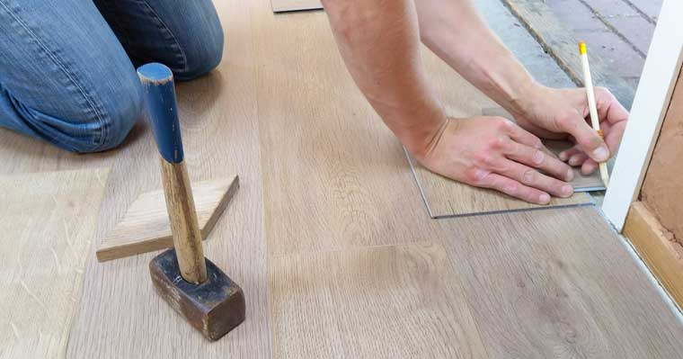

When you are going to remodel your home you want the project to go smoothly and easily without any stress at all, and I think would agree with me it doesn't always go that way.

Here's a checklist of the top 4 things that will help you on your next home remodeling project:

## 1. Have a remodeling budget.

Having a budget in mind is very important, it helps you know how much you are going to spend on paint, cabinets, flooring and much more.When you have a budget you save money and also reduces the stress on spending too much for what it is. 

## 2. Have a design or style in mind.

It's important when remodeling your home to know what design you want, and also having a 
style that you'll enjoy, and also stick to one sort of style that will go with everything in the house, to make it look better.

If you are on a strict budget then go with a design that's more simpler and little by little maybe change things around to make it look better.

Tip: It's also good to ask someone for a second opinion.

## 3. Plan out your daily routine.

One of the top primary ways in general to reduce stress is to have a good routine in your day to day life, and when you are going to remodel your house, your schedule is probably going to change.

And when you follow your routine it doesn't mean that that the new routine you made will be the only one you're going to follow, if you encounter any setbacks, it's good to modify it if possible.

## 4. Give yourself more time if needed.

When you are going to start on this project it's going to be an exciting journey, and it may be so exciting that you want to start right away, but to make it go successful, it may mean not starting on it right away and take time to learn about how it processes. 

