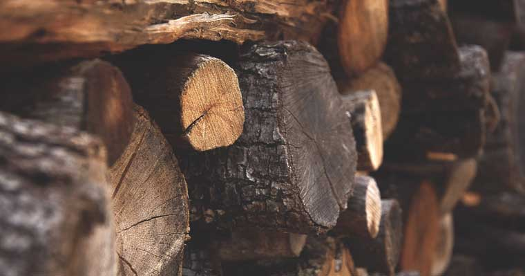

# Sustainable Woodworking: How to Create Eco-Friendly Home Renovations in Puerto Vallarta

In today's world, homeowners are increasingly conscious about their environmental impact. At Centro Carpintero, we've been pioneering sustainable woodworking practices in Puerto Vallarta for years, combining traditional Mexican craftsmanship with modern eco-friendly approaches. Here's how you can create stunning, environmentally responsible home renovations that benefit both your family and our beautiful coastal ecosystem.

## Why Choose Sustainable Woodworking?

Sustainable woodworking isn't just a trend—it's a responsibility. When you choose eco-friendly renovation practices, you're:

- **Reducing carbon footprint** by using locally sourced materials
- **Supporting local ecosystems** through responsible harvesting
- **Creating healthier indoor environments** with natural, non-toxic materials
- **Investing in long-lasting quality** that reduces future waste
- **Preserving traditional craftsmanship** for future generations

## The Magic of Local Tropical Hardwoods

Puerto Vallarta's tropical climate provides access to some of the world's most beautiful and durable hardwoods. At Centro Carpintero, we specialize in working with locally sourced tropical species that are both stunning and sustainable:

### Parota Wood: The Golden Beauty
Our signature Parota wood (also known as Guanacaste) is a local favorite for good reason:
- **Naturally pest-resistant** - no harmful chemical treatments needed
- **Water and rot resistant** - perfect for our humid coastal climate
- **Beautiful golden-brown grain** that ages gracefully
- **Fast-growing species** that regenerates quickly when harvested responsibly

### Kumaru: The Ironwood of the Tropics
For outdoor applications like BBQ areas and decking:
- **Incredibly durable** - lasts 25+ years with minimal maintenance
- **Naturally weather-resistant** - no chemical preservatives required
- **Dense hardwood** that withstands heavy use and tropical storms

## Our Sustainable Practices at Centro Carpintero

### 1. Local Material Focus
We prioritize working with:
- Locally sourced tropical hardwoods when available
- Regional suppliers to reduce transportation impact
- Quality materials that ensure long-lasting results
- Traditional wood species native to our area

### 2. Efficient Material Use
Our experienced craftsmen practice:
- Careful planning to minimize waste
- Creative use of wood pieces in custom designs
- Precision cutting techniques for optimal material usage
- Quality construction that reduces need for replacements

### 3. Quality Finishes
We select finishes that are:
- Appropriate for Puerto Vallarta's coastal climate
- Long-lasting to reduce maintenance needs
- Safe for indoor use in family homes
- Designed to enhance the natural beauty of wood

### 4. Skilled Craftsmanship
Our approach emphasizes:
- Traditional Mexican woodworking techniques
- Precision hand-finishing for quality results
- Attention to detail that ensures durability
- Custom solutions tailored to each project

## Eco-Friendly Design Ideas for Your Home

### Kitchen Renovations
- **Custom wood islands** using beautiful Parota wood
- **Natural stone countertops** that complement wood finishes
- **Open shelving designs** that create spacious, airy kitchens
- **Built-in storage solutions** that maximize functionality

### Bathroom Transformations
- **Custom vanities** crafted from water-resistant hardwoods
- **Shower benches** designed for comfort and durability
- **Natural wood accents** that bring warmth to bathroom spaces
- **Custom storage solutions** tailored to your needs

### Outdoor Living Spaces
- **Pergolas and gazebos** using durable tropical hardwoods
- **Custom outdoor furniture** built to withstand coastal weather
- **Deck and patio designs** that complement your landscape
- **BBQ areas** crafted from weather-resistant Kumaru wood

## The Long-Term Benefits

Choosing sustainable woodworking for your Puerto Vallarta home renovation offers lasting advantages:

### Financial Benefits
- **Higher resale value** - eco-friendly homes are increasingly sought after
- **Lower maintenance costs** - quality hardwoods last decades with proper care
- **Energy savings** - natural materials provide better insulation
- **Tax incentives** - many green building practices qualify for rebates

### Health Benefits
- **Improved indoor air quality** with natural, non-toxic materials
- **Better humidity regulation** - wood naturally balances moisture
- **Reduced allergens** - fewer synthetic materials mean fewer irritants
- **Stress reduction** - natural wood environments promote wellbeing

### Environmental Impact
- **Carbon sequestration** - wood stores carbon throughout its lifetime
- **Reduced transportation emissions** using local materials
- **Biodiversity support** through responsible forest management
- **Waste reduction** through efficient material use

## Getting Started with Your Sustainable Renovation

### Step 1: Assessment and Planning
Our team conducts a comprehensive evaluation of your space, considering:
- Existing materials that can be repurposed
- Natural lighting and ventilation opportunities
- Local climate considerations for material selection
- Your family's lifestyle and sustainability goals

### Step 2: Material Selection
We help you choose the perfect combination of:
- Locally sourced hardwoods for primary structures
- Reclaimed materials for accent pieces
- Natural stone and tile from regional suppliers
- Eco-friendly finishes and hardware

### Step 3: Craftsmanship Excellence
Our skilled artisans bring decades of experience in:
- Traditional joinery techniques that eliminate need for toxic adhesives
- Precision fitting that maximizes material efficiency
- Hand-finishing techniques that enhance natural beauty
- Quality construction that lasts generations

## Why Choose Centro Carpintero for Your Sustainable Project?

With over 15 years serving Puerto Vallarta's discerning homeowners, we offer:

- **Deep local knowledge** of the best sustainable materials and suppliers
- **Proven track record** with hundreds of successful eco-friendly projects
- **Skilled craftsmen** trained in both traditional and modern sustainable techniques
- **Comprehensive service** from design through installation and maintenance
- **Transparent pricing** with no hidden costs or surprises

## Ready to Transform Your Home Sustainably?

Your dream of an eco-friendly, beautiful home renovation is within reach. At Centro Carpintero, we're passionate about creating spaces that honor both your vision and our environment.

**Contact us today for your free consultation:**
- **Phone:** 322-121-6778
- **Email:** centrocarpinteropv@gmail.com
- **Address:** Carretera a las Palmas #2523, Puerto Vallarta, Jalisco 48280

Let's work together to create a home that's as beautiful as it is responsible—a space where traditional Mexican craftsmanship meets modern sustainability, perfectly suited for life in paradise.

---

*Centro Carpintero has been Puerto Vallarta's premier sustainable woodworking and renovation company since 2008. We're proud to combine traditional Mexican craftsmanship with modern eco-friendly practices, creating beautiful homes that respect both our clients' vision and our coastal environment.*
