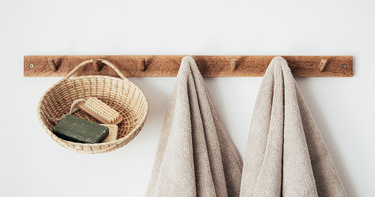

When it comes to renovating your bathroom there are so many designs, and trends that you can find on the web to make your bathroom look better and comfortable.

Here at Centro Carpintero we don't just renovate bathrooms, but we also turn your simple ordinary bathroom into a dream bathroom, something you can brag about to your friends and family.

I'm just going to mention 3 simple ways to make your bathroom look and make you feel comfortable:

## Brighten things up.

Having lighting in the bathroom is a must, no one likes to enter a bathroom that has very poor lighting, it just makes you and others feel uncomfortable.
So adding more than one lighting fixture, can add more color and make you feel relaxed.

## Adding Ventilation.

Ventilation is important especially if you live in an area where it's tropical, adding ventilation to a bathroom prevents mold and mildew to spread and ruin your bathroom. 

So by adding a functional window or a small ceiling fan is important and if you don't have any ventilation built in your bathroom, it should be cared for right away. 

## Flooring.

When it comes to flooring there are so many different types of colors, designs and patterns, but also just adding simple plan flooring makes your bathroom look just as nice.
Also when choosing what type of flooring you want it's probably wise to choose ceramic tile, because it's waterproof as well it's easier to clean.

