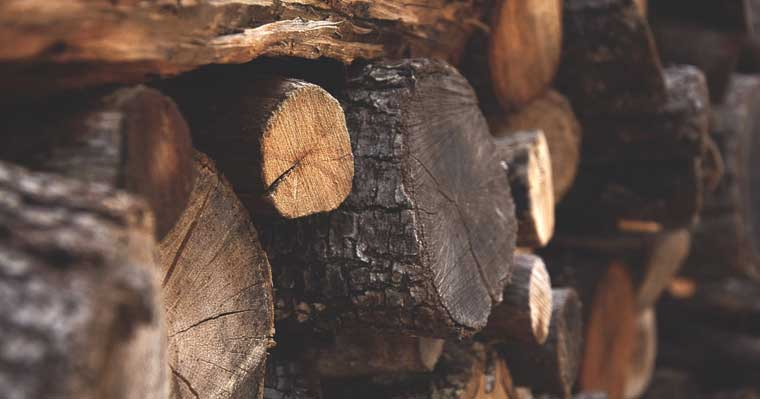

La madera es uno de los materiales más antiguos y utilizados para la construcción en todo el mundo, especialmente aquí en México. Se utiliza para fabricar muebles, armarios y para carpintería fina a medida. De hecho, lo sorprendente es que hay aproximadamente 52 tipos diferentes de madera en México, pero solo nos vamos a enfocar en los 3 tipos principales de madera que usamos en nuestra carpintería fina y renovaciones de viviendas. Son Parota, Primavera y Amapa (palo de rosa). A continuación se muestran los pros y los contras de cada madera:

## Parota
La madera de parota, también llamada guanacaste, se encuentra principalmente en México y América Central. Su color es marrón dorado. Una hermosa madera para usar en diseños de muebles.

### Pros

  * Es asequible.
  * Contiene una resistencia natural a los insectos que lo hace a prueba de termitas.
  * Resistente a la putrefacción y al agua.

### Contras

  * La madera de Parota es madera dura, pero sigue siendo liviana, por lo que es posible que no pueda (dependiendo de cómo esté hecha) soportar un peso significativo cuando se usa una mesa de comedor o una cómoda.

** Seguridad **: la madera de parota puede ser tóxica y, si no se maneja adecuadamente, puede causar una infección ocular o respiratoria, así que asegúrese de dejar que un carpintero capacitado y experimentado haga el trabajo por usted.

##Amapa (palo de rosa)
La madera de amapa (palo de rosa), que se encuentra en América Central en las regiones amazónicas, viene en diferentes tonos de marrón claro a blanco, y se utiliza para instrumentos musicales, enchapados y muebles.

### Pros

  * La madera de amapa es fácil de trabajar, serrar, clavar y también pegar.
  * Es estable en cualquier tipo de clima y resistente a los rayos UV del sol.
  * Resistente a insectos y putrefacción.
  * Se sabe que dura más que otros tipos de madera.

### Contras

  * Puede ser costoso dependiendo de dónde lo compre.
  * Puede ser muy pesado.

## Primavera
La madera Primavera, que se encuentra en el sur de México, se presenta en diferentes tipos de colores pálidos y es una de las más utilizadas en México para la carpintería.

### Pros
  * La madera Primavera es una madera más blanda, por lo que facilita el trabajo.
  * Resistente a la descomposición.

### Contras
  * Puede ser susceptible a los ataques de insectos si no se trata adecuadamente.

