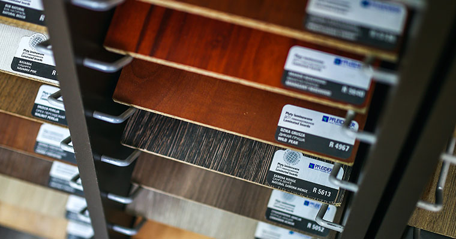

Los gabinetes son una de las cosas más importantes para tener en una cocina, es donde puedes guardar utensilios, comida, especias, casi cualquier cosa que elijas y, en última instancia, te ayuda a esconder o incluso evitar el desorden en tu cocina.

Pero también cuando se trata del tema de los gabinetes, especialmente si está renovando su cocina, probablemente habrá algunas preguntas.

Así que aquí hay 3 preguntas y respuestas que pueden ser útiles:

## ¿Cuál es el mejor lugar para tener los gabinetes de su cocina?

El lugar más recomendado para instalar los gabinetes de cocina es encima de tu cabeza, te permite tener más espacio en el piso de tu cocina, especialmente si tienes una cocina pequeña.

## ¿Agregar nuevos gabinetes en mi cocina aumenta el valor de mi hogar?

Absolutamente, porque uno de los lugares más importantes donde un comprador de vivienda inspecciona es la cocina, y si la cocina parece moderna y nueva, probablemente llamará la atención de los compradores de vivienda.

## ¿De qué están hechos los armarios del Centro Carpintero?

En centro carpintero utilizamos principalmente 3 tipos diferentes de madera que son madera de Parota, Amapa (palo de rosa) y madera de primavera.
Estos 3 tipos de madera que mencioné son muy duraderos y también asequibles si tienes un presupuesto limitado.