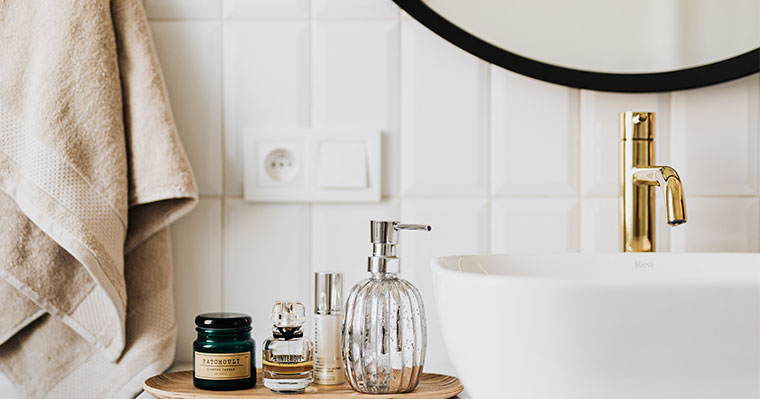

Seguir las últimas tendencias es lo más común que hacen muchas personas, y cuando se trata del tema de los baños, hay tantos estilos, diseños y características diferentes que la gente agrega a su baño para darles esa sensación de comodidad y especialmente para sentirse bien. sobre ellos mismos, y en el Centro Carpintero ese es nuestro enfoque principal, así que para hacerlo más fácil, voy a mencionar 5 nuevas tendencias populares de 2021, que espero puedan ser útiles.

## AÑADIR ACENTOS DE MADERA.

Tener tonos más cálidos en su baño es muy popular cuando se trata de tendencias, y una forma de agregar esa calidez a su baño es tener ese acento clásico de madera oscura o clara. Entonces, al agregar gabinetes de madera, estanterías o incluso un tocador, agregará ese toque de calidez a su baño.

## TENGA GRANDES BAÑERAS Y DUCHAS ABIERTAS.

Si está remodelando su baño y está agregando una expansión para más espacio, ¿por qué no pensar en agregar una bañera más grande o incluso agregar una ducha abierta? Hacer eso lo hace sentir que tiene más espacio y también lo ayuda a sentirse especialmente relajado. después de un largo día de trabajo y, lo que es más importante, agrega más valor a su hogar.

## AÑADIR PATRONES DE AZULEJOS.

Cuando se trata de elegir baldosas para el baño, hay tantos diseños para elegir, como que hay diferentes colores, tamaños y formas, pero cuando se trata de lo que es el más popular y moderno de todos ellos es el patrón de unión de pila y el patrón recto, y cuando eliges este diseño, debes tenerlo encima de otro patrón y, al hacerlo, hace que el baño se vea limpio y moderno.    

## AGREGUE COLORES VINTAGE COMO LATÓN Y ORO.

Tener accesorios de oro o latón en su baño ha existido durante bastante tiempo y el aspecto nunca ha envejecido y la razón por la que nunca ha envejecido es que hace que su baño se sienta cálido y lujoso.

## AÑADIR COLORES DAKER.

Tener colores oscuros en tu baño se ha ido popularizando poco a poco, y uno de los colores más populares que poco a poco se está llevando a la dominación es el color negro y gris, y la razón por la que se está volviendo tan popular es que agrega acentos a la accesorios en su baño que hacen que su baño tenga ese aspecto moderno vintage.