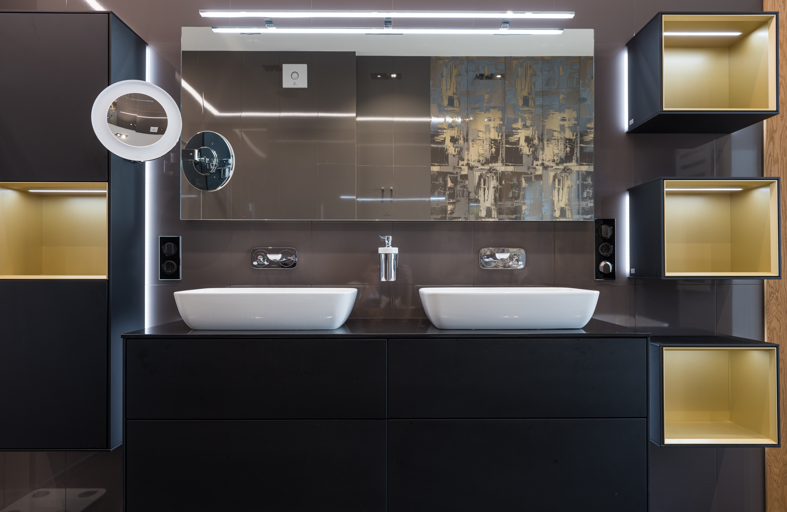

Los tocadores dobles es tener dos lavabos separados en el mismo baño, y esta vieja tendencia ha sido algo común en los hogares, pero solo porque es algo común en los baños no significa que sea para todos, así que voy a ayudarlo a decidir si instalar un tocador doble en su baño es la opción correcta para usted o si cambiar su tocador doble ya existente en uno solo.

## ¿Los pros de un tocador doble?

 * Dos pueden usarlo al mismo tiempo

Al tener un tocador doble significa que dos personas pueden compartir el baño al mismo tiempo, lo que puede ser útil, porque no tienes que esperar a que tu pareja termine de usar el lavabo, lo que significa que te va a salvar. a veces.

 * Va a agregar valor a tu hogar

El valor de su casa va a subir, porque agregó un tocador doble, y significa que todo el mantenimiento y el trabajo que le dedique se pagará cuando la venda, y la razón por la que agrega valor a su casa. casa es porque muchas personas ven tener un tocador doble como un lujo, especialmente cuando sus clientes o compradores son parejas o familias numerosas.

## Y por último, pero no menos importante, ¿las desventajas de un tocador doble?

 * El costo

Tener un tocador doble va a costar mucho más que tener un tocador único. Cuando lo piensas, significa que habrá doble plomería, también necesitarás instalar un tocador más grande o más largo para poder colocar los dos lavabos, y como tienes dos lavabos, entonces solo tienes uno, hay va a haber más mantenimiento.

 * Menos espacio

Como mencioné antes, tener un tocador doble significa que necesitará instalar un tocador más grande y más largo, esto significa que el diseño de la habitación será más pequeño (dependiendo de la distribución de la habitación), además de tener un lavabo doble ocupará parte del espacio de su encimera.

<strong>Consejo:</strong>antes de instalar un tocador doble en su baño, asegúrese de tener suficiente espacio para moverse, porque nadie quiere estar encajado con su pareja al cepillarse los dientes.

