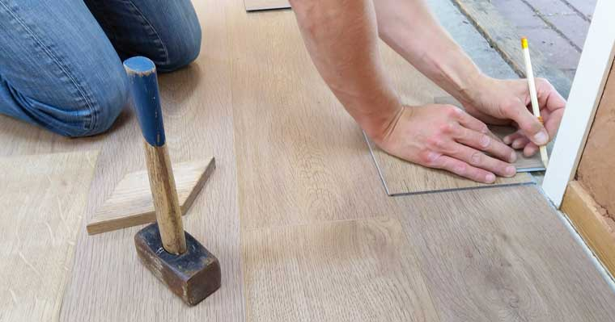

Cuando instalemos sus nuevos gabinetes, probablemente desee que permanezcan y tengan el mismo aspecto durante muchos años, por lo que voy a mencionar el mantenimiento para mantener sus gabinetes como nuevos.

## El hacer

 * Evite exponer sus gabinetes a fuentes de calor altas, para evitar que se sequen, agrieten, encojan o deformen de manera permanente.

 * Pula sus gabinetes al menos una o dos veces al año, usando un pulidor a base de aceite, no a base de cera.

 * Seque bien los gabinetes cuando haya terminado de limpiar.

 * Use un poco de jabón para lavar platos y agua tibia al limpiar.

 * Use un paño de microfibra sintética para limpiar sus gabinetes.

## Lo que no debes hacer

 * No use productos que contengan lejía.

 * No uses un paño de cocina al limpiar tus gabinetes porque puede contener grasa o incluso partículas que pueden arruinar el acabado.

 * No mojes tus gabinetes.

