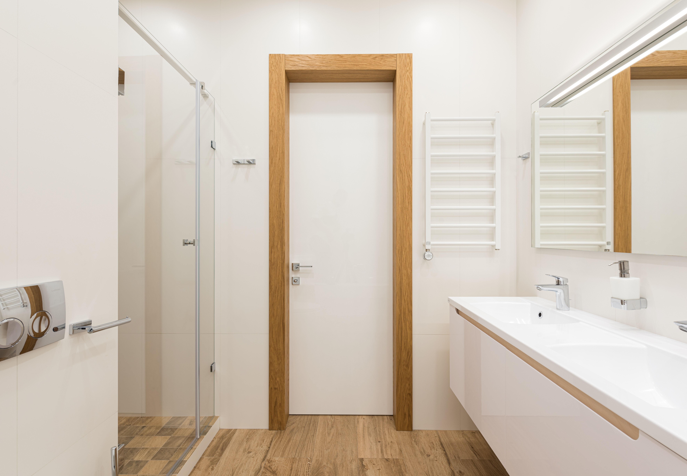

Cuando tenga un espacio limitado o una familia numerosa, es posible que desee considerar agregar un baño Jack and Jill a su casa, pero como con cualquier tipo de renovación de baño, siempre tendrá sus pros y sus contras, y vamos a mencionar esos pros y contras para que pueda decidir si es la opción correcta.

## ¿QUÉ ES UN BAÑO DE JACK Y JILL?

A Jack and Jill bathroom is a bathroom that is shared by two rooms, meaning that it has two entrances to the bathroom. Some Jack and Jill bathrooms have separate vanities or separate sinks.Privacy is also ensured by having a lock on both doors.

##  PROS 

 * Ahorra espacio

Los baños ocupan mucho espacio en la casa, especialmente si cada habitación tiene su propio baño, pero tener dos habitaciones que comparten un baño ahorra una tonelada de espacio en una casa, especialmente si ya no tienes mucho espacio libre en la casa. tu casa.

 * Útil para familias numerosas

Los baños Jack and Jill son útiles para familias numerosas e incluso para invitados. Si bien es posible que las personas que comparten el baño necesiten averiguar quién lo va a usar, un baño compartido como este puede ayudar a que su hogar maneje a varias personas de manera más eficiente.

 * Aún brinda privacidad

Aunque un baño de Jack and Jill es un baño compartido, aún permite que las personas tengan privacidad. Debido a que las puertas del baño deben tener cerraduras a ambos lados, las habitaciones conectadas a ellas aún permanecen separadas y mantienen la privacidad. Y, dado que ambas puertas se pueden cerrar con llave, el baño brinda privacidad cuando es necesario. Puede crear un diseño si es necesario para incluir una separación adicional entre el área del lavabo y la bañera / ducha y el inodoro para brindar más privacidad si es necesario.

## CONTRAS

 * Los baños Jack y Jill pueden aislarse

Cuando un baño de Jack and Jill está ubicado entre dos dormitorios, significa que no es tan accesible para el resto de la casa. La mayoría de las veces, esto no se debe a que haya otros baños disponibles en el hogar. Además, no debería ser un problema si se conecta a un pasillo.

 * Pueden crear conflictos

Los baños de Jack y Jill pueden crear conflictos. Porque más de una persona necesita usarlo. Uno de los errores de diseño de baño más comunes que se deben evitar es ignorar o no planificar el flujo y la función adecuados. Tener el flujo y la función correctos es esencial para cualquier baño y especialmente para un baño Jack and Jill.
Cuando los horarios se vuelven agitados y la gente se vuelve terca, un baño como este puede convertirse en un punto de discusión. El otro lado de eso es que las personas que lo comparten necesitan aprender a compartir, comprometerse y comunicarse para que cada uno obtenga lo que necesita.
 
 * Los baños de Jack y Jill pueden no seguir siendo útiles a largo plazo
 
Debido a que estos baños están conectados a habitaciones específicas y pueden quedar sin litoral de alguna manera, también pueden volverse menos útiles y eficientes con el tiempo. Por ejemplo, si se decidió por un baño Jack and Jill para miembros específicos de la familia, ¿seguirá teniendo sentido el diseño del baño a medida que esos miembros de la familia crezcan y finalmente se muden?
