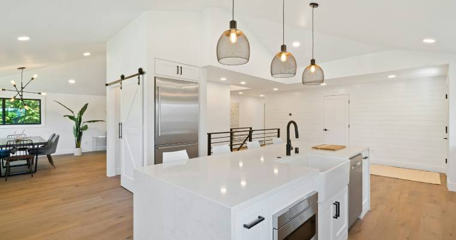

# Por Qué Renovar su Cocina o Baño en Puerto Vallarta: Aumente el Valor de su Propiedad e Ingresos de Renta

Si usted es propietario en Puerto Vallarta—ya sea su residencia principal, casa de vacaciones o inversión de renta—renovar su cocina o baño no es solo cuestión de estética. Es una de las decisiones financieras más inteligentes que puede tomar. Estas mejoras ofrecen retornos medibles a través del aumento del valor de la propiedad, precios de venta más altos e ingresos de renta significativamente mayores.

En Centro Carpintero, hemos ayudado a innumerables propietarios de Puerto Vallarta a transformar sus propiedades con renovaciones personalizadas de cocinas y baños. Aquí le explicamos por qué estas inversiones valen la pena—respaldadas por datos reales.

## El Impacto Financiero: Números Reales en los que Puede Confiar

### Las Renovaciones de Cocina Ofrecen un ROI Sólido

Según datos de la industria, las renovaciones de cocina se clasifican consistentemente entre las mejoras del hogar con mayor retorno:

**Remodelaciones Menores de Cocina:**
- **ROI: 70-80%** de los costos recuperados en la reventa
- Algunos mercados ven un ROI tan alto como **96-113%**
- Típicamente recuperan una porción significativa de la inversión en la reventa

**Remodelaciones Mayores de Cocina:**
- **ROI: 50-60%** de los costos recuperados
- Las renovaciones integrales agregan valor sustancial a la propiedad
- Atraen a compradores que buscan casas listas para habitar

*Nota: Los porcentajes de ROI provienen de reportes de la industria ([Reporte de Impacto de Remodelación 2022 de la Asociación Nacional de Agentes Inmobiliarios](https://www.nar.realtor/sites/default/files/documents/2022-remodeling-impact-report-04-19-2022.pdf), [Reporte Costo vs. Valor 2024 de Remodeling Magazine](https://www.jlconline.com/cost-vs-value/2025/)). Los costos competitivos de mano de obra y materiales en Puerto Vallarta pueden resultar en ratios de ROI aún mejores en comparación con otros mercados.*

### Renovaciones de Baño: Retornos Igualmente Impresionantes

Las remodelaciones de baño ofrecen retornos comparables con costos iniciales frecuentemente más bajos:

**Remodelaciones de Baño de Rango Medio:**
- **ROI: 60-74%** de los costos recuperados
- **71% de recuperación de costos promedio** en renovaciones típicas
- Fuertes retornos en inversiones de modernización

**Remodelaciones de Baño de Lujo:**
- **ROI: 45-50%** para mejoras de lujo
- Los acabados premium atraen a compradores de alto nivel
- Más adecuadas para mercados de propiedades de lujo

*Nota: Los porcentajes de ROI provienen de reportes de la industria ([Asociación Nacional de Agentes Inmobiliarios](https://www.nar.realtor/sites/default/files/documents/2022-remodeling-impact-report-04-19-2022.pdf), [Remodeling Magazine 2024](https://www.jlconline.com/cost-vs-value/2025/)). Los costos competitivos de mano de obra y materiales en Puerto Vallarta pueden ofrecer retornos aún más fuertes para los propietarios.*

### Velocidad de Venta: Venda su Propiedad Más Rápido

Más allá del valor en dólares, las cocinas y baños renovados impactan dramáticamente qué tan rápido se vende su propiedad:

- Las casas con baños recientemente renovados se venden **23% más rápido** que aquellas con accesorios anticuados
- Las cocinas actualizadas son la característica #1 que buscan los compradores modernos
- 24% de los propietarios priorizaron renovaciones de cocina en 2024
- 24% priorizaron mejoras de baño—empatados como la renovación más popular

*Fuente: [Estudio Houzz and Home 2025](https://st.hzcdn.com/static/econ/2025-US-Houzz-and-Home.pdf)*

## Por Qué las Propiedades en Puerto Vallarta Se Benefician Aún Más

### La Ventaja de las Rentas Vacacionales

El próspero mercado de rentas vacacionales de Puerto Vallarta hace que las renovaciones de cocina y baño sean aún más valiosas:

**Aumento de Ingresos de Renta:**
- Las propiedades renovadas obtienen **10-20% más en tarifas de renta**
- Las cocinas modernas atraen huéspedes premium dispuestos a pagar más
- Los baños actualizados son esenciales para reseñas positivas
- Las propiedades con cocinas/baños renovados ven tasas de ocupación más altas

**Mejores Reseñas de Huéspedes:**
- Las comodidades modernas generan reseñas de 5 estrellas
- Las reseñas positivas impulsan más reservaciones
- Las calificaciones más altas justifican precios premium

### Aumentos en el Valor de la Propiedad

Las propiedades bien renovadas en mercados competitivos como Puerto Vallarta pueden ver aumentos en el valor de la propiedad de **hasta 25%**, especialmente cuando se enfocan en áreas de alto impacto como cocinas y baños.

**Para Inversionistas de Propiedades de Renta:**
- **60-70% ROI** en renovaciones de cocina y baño
- Tasas de vacancia reducidas con comodidades modernas
- Atrae inquilinos de mayor calidad y a largo plazo
- Menores costos de mantenimiento con nuevos accesorios y electrodomésticos

*Fuente: [Estudio de ROI de Today's Homeowner](https://todayshomeowner.com/home-finances/guides/roi-of-remodel/), [Guía de Propiedades de Renta de PURE HomeRiver](https://purehomeriver.com/resources/blog/an-investor-guide-to-renovating-a-rental-property/)*

## ¿Qué Hace que una Renovación de Cocina o Baño Valga la Pena?

### Enfóquese en Mejoras de Alto Impacto

No todas las renovaciones ofrecen retornos iguales. Esto es lo que funciona mejor:

**Mejoras de Cocina que Valen la Pena:**
- Nuevas encimeras (cuarzo, granito o piedra local)
- Gabinetes modernos con almacenamiento eficiente
- Electrodomésticos de eficiencia energética
- Accesorios de iluminación actualizados
- Salpicadero fresco con azulejo local
- Herrajes y accesorios de calidad

**Mejoras de Baño que Agregan Valor:**
- Tocadores modernos (los tocadores flotantes están de moda)
- Regaderas walk-in o sin bordillo
- Accesorios de bajo flujo que ahorran agua (reducen el uso de agua **hasta en 60%**)
- Iluminación LED (usa **75% menos energía**)
- Trabajo de azulejo de calidad
- Acabados neutrales y atemporales

### La Ventaja de Puerto Vallarta: Materiales Locales

El uso de maderas tropicales locales como Parota y materiales regionales agrega carácter único que:
- Atrae a compradores que buscan diseño mexicano auténtico
- Diferencia su propiedad de renovaciones genéricas
- Apoya la artesanía local
- Frecuentemente cuesta menos que materiales importados

## Evite la Sobre-Personalización: El Equilibrio que Importa

Si bien las renovaciones agregan valor, hay un punto óptimo:

**Haga Esto:**
- Elija diseños neutrales y atemporales
- Use materiales de calidad que duren
- Enfóquese en funcionalidad y flujo
- Mantenga acabados clásicos y atractivos para audiencias amplias

**Evite Esto:**
- Mejoras ultra-lujosas en vecindarios de precio promedio
- Opciones de diseño demasiado personalizadas o de nicho
- Gastar más del 10-15% del valor de su casa en una sola habitación
- Diseños de moda que pueden verse anticuados rápidamente

La clave es crear un espacio que atraiga a la gama más amplia de compradores o inquilinos mientras mantiene calidad y estilo.

## Los Beneficios a Largo Plazo Más Allá del ROI

### Costos de Mantenimiento Reducidos

Las cocinas y baños nuevos significan:
- Menos reparaciones de emergencia
- La plomería moderna reduce riesgos de fugas
- Los electrodomésticos de eficiencia energética reducen las facturas de servicios
- Los sistemas eléctricos actualizados son más seguros y confiables

### Calidad de Vida Mejorada

Si vive en la propiedad:
- Disfrute de un espacio más funcional y hermoso diariamente
- Mejor almacenamiento y organización
- Mayor eficiencia energética significa facturas más bajas
- Las comodidades modernas mejoran el confort

### Ventaja Competitiva en el Mercado de Puerto Vallarta

El mercado inmobiliario de Puerto Vallarta es competitivo. Las propiedades con cocinas y baños actualizados:
- Se destacan en los listados
- Atraen más solicitudes de visitas
- Generan ofertas más altas
- Atraen a compradores internacionales con expectativas modernas

## Cuándo Renovar: El Momento Importa

**Mejores Momentos para Renovar en Puerto Vallarta:**
- **Antes de listar su propiedad para venta:** Maximice el precio de venta y velocidad
- **Durante la temporada baja de rentas:** Minimice la pérdida de ingresos de renta
- **Antes de refinanciar:** El aumento del valor de la propiedad puede mejorar los términos del préstamo
- **Después de comprar una propiedad para arreglar:** Las renovaciones inmediatas lo preparan para el éxito

**Perspectiva del Mercado:**
Se proyecta que la industria de remodelación verá un **crecimiento del 1.2% en 2025**, indicando un ambiente estable para inversiones en mejoras del hogar.

*Fuente: [Centro Conjunto de Estudios de Vivienda de Harvard](https://www.jchs.harvard.edu/press-releases/modest-gains-2025-outlook-home-remodeling)*

## Ejemplo del Mundo Real: Los Números en Acción

**Escenario: Renovación de Cocina y Baño de Rango Medio en Puerto Vallarta**

**Retornos Esperados:**
- Renovación de cocina: **75% ROI** (típico para remodelaciones menores a medianas)
- Renovación de baño: **72% ROI** (típico para actualizaciones de rango medio)
- Las renovaciones combinadas maximizan el atractivo general de la propiedad

**Beneficios Adicionales:**
- Aumento de ingresos de renta: **10-20%** para propiedades actualizadas
- La propiedad se vende **23% más rápido** con baños renovados
- Atrae inquilinos/compradores de mayor calidad
- **Período de recuperación: 2-5 años a través de ingresos de renta** dependiendo de las condiciones del mercado

*Nota: Los costos y retornos reales varían según el alcance del trabajo, los materiales seleccionados y la ubicación de la propiedad. Contacte a Centro Carpintero para una cotización detallada específica para su proyecto.*

## Por Qué Elegir Centro Carpintero para su Renovación en Puerto Vallarta

En Centro Carpintero, entendemos el mercado de Puerto Vallarta y lo que los compradores e inquilinos quieren. Nuestras renovaciones personalizadas de cocinas y baños están diseñadas para:

- **Maximizar su ROI** con elecciones de diseño inteligentes
- **Usar materiales locales de calidad** que agregan carácter auténtico
- **Mantenerse dentro del presupuesto** sin sacrificar calidad
- **Completar proyectos eficientemente** para minimizar interrupciones
- **Crear diseños atemporales** que atraigan a audiencias amplias

Hemos ayudado a cientos de propietarios e inversionistas a aumentar el valor de sus propiedades a través de renovaciones estratégicas. Ya sea que se esté preparando para vender, buscando aumentar los ingresos de renta, o simplemente quiera disfrutar de un espacio más hermoso, entregamos resultados que valen la pena.

## La Conclusión: Las Renovaciones Son Inversiones, No Gastos

Los datos son claros: las renovaciones de cocina y baño en Puerto Vallarta ofrecen:

✓ **60-80% ROI** en remodelaciones de cocina  
✓ **60-74% ROI** en remodelaciones de baño  
✓ **10-20% más de ingresos de renta** para propiedades de inversión  
✓ **Hasta 25% de aumento en el valor de la propiedad** con mejoras integrales  
✓ **23% de ventas más rápidas** con baños actualizados  
✓ **Costos de mantenimiento reducidos** y mejor retención de inquilinos  

Estas no son solo mejoras cosméticas—son inversiones estratégicas que entregan retornos financieros medibles mientras mejoran su vida diaria o negocio de rentas.

## ¿Listo para Aumentar el Valor de su Propiedad?

Ya sea que sea un propietario que busca vender, un inversionista que busca mayores ingresos de renta, o simplemente quiera disfrutar de un espacio más hermoso, Centro Carpintero puede ayudarlo a alcanzar sus objetivos con una renovación personalizada de cocina o baño.

**Contáctenos hoy para una consulta gratuita y descubra cuánto valor podemos agregar a su propiedad en Puerto Vallarta.**

---

*Todas las estadísticas y cifras de ROI se basan en reportes de la industria de la [Asociación Nacional de Agentes Inmobiliarios](https://www.nar.realtor/sites/default/files/documents/2022-remodeling-impact-report-04-19-2022.pdf), [Reporte Costo vs. Valor 2024-2025 de Remodeling Magazine](https://www.jlconline.com/cost-vs-value/2025/), [Estudio Houzz and Home 2025](https://st.hzcdn.com/static/econ/2025-US-Houzz-and-Home.pdf), y estudios de inversión en propiedades de renta. Los resultados individuales pueden variar según la ubicación de la propiedad, calidad del trabajo y condiciones del mercado.*
